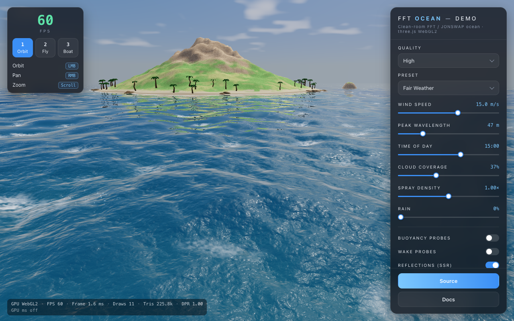
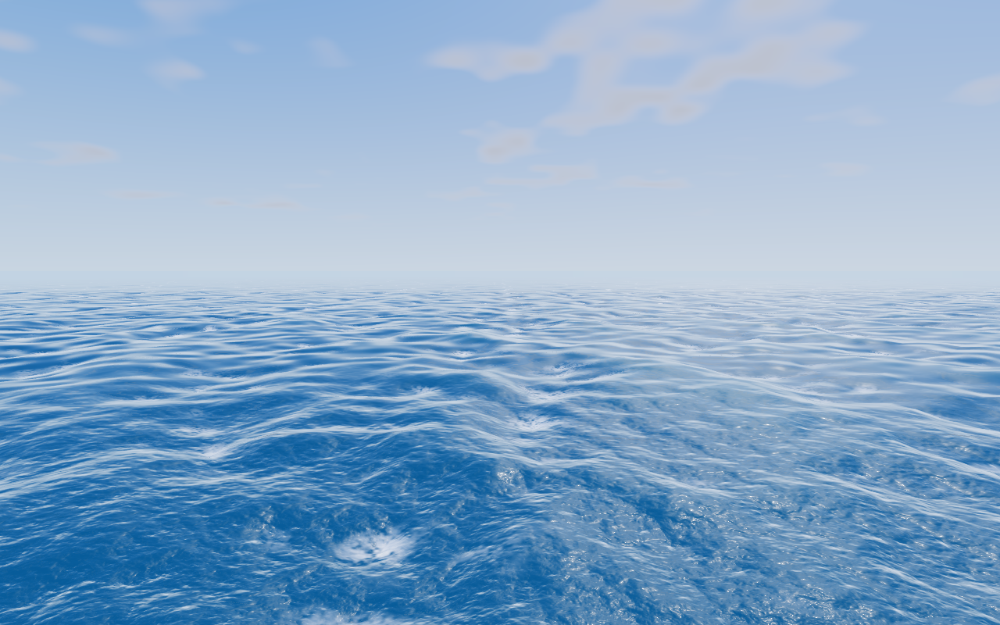
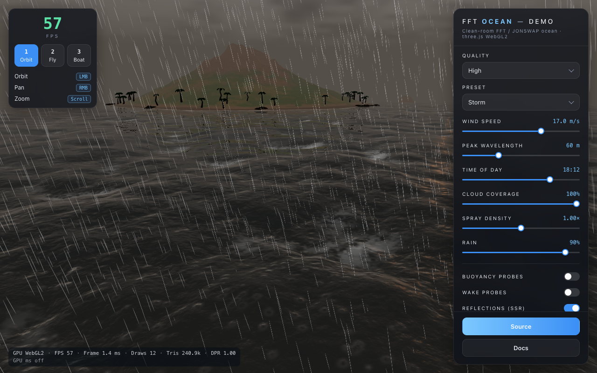
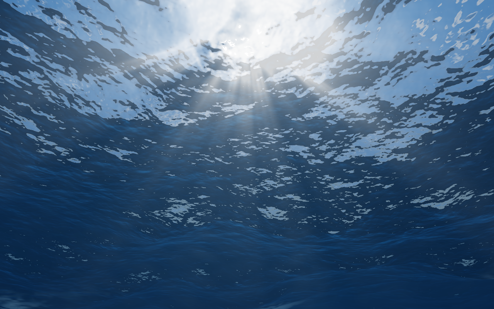
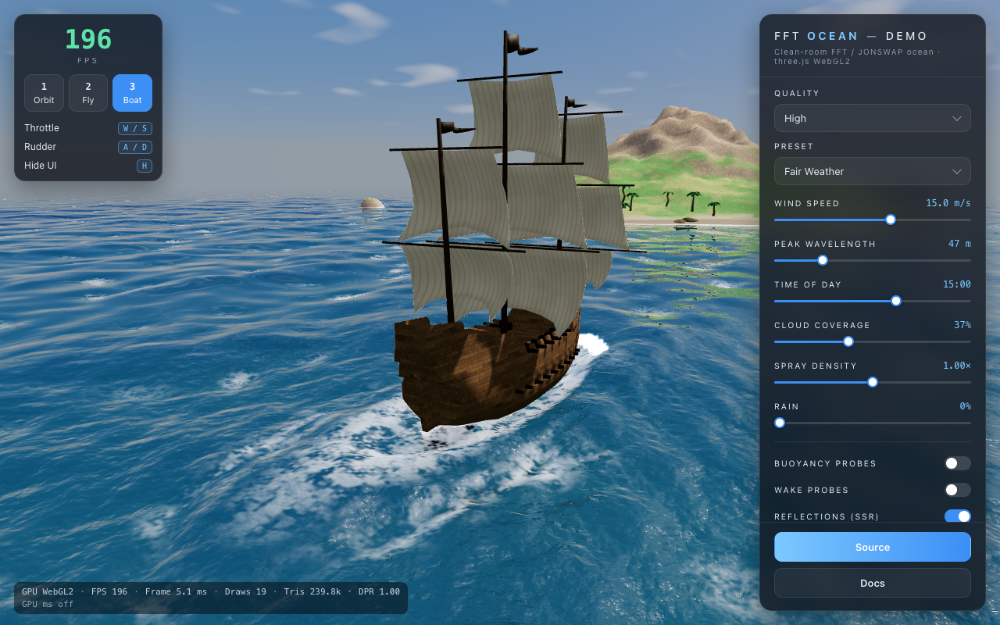
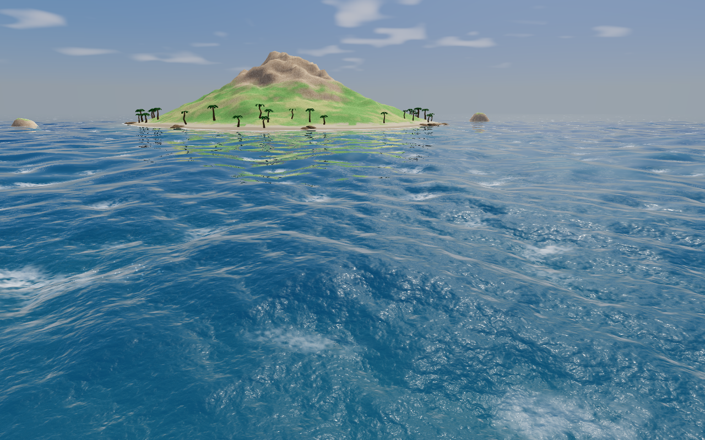

# FFT Ocean

**[Live demo →](https://blainebooher.com/clean-room-fft-ocean/)** (WebGL2; desktop GPU recommended)

A clean-room, for-fun reimplementation of an FFT / JONSWAP ocean on
three.js **WebGL2**, inspired by the public *Three.js Water Pro* demo. No
code from it — the product's bundle is obfuscated and its licence forbids
deobfuscation, so nothing here was derived from reading it. The physics comes
from the literature: Tessendorf 2001 (*Simulating Ocean Water*), Hasselmann
et al. 1973 (JONSWAP) and 1980 (directional spread), and Horvath 2015
(*Empirical directional wave spectra for computer graphics*).

### What "clean room" means here, precisely

Three kinds of input went in, and it is worth being exact about which:

- **Published papers** for every algorithm — the spectrum, the dispersion
  relation, the butterfly FFT, Jacobian foam, iWave ripples, the radial
  sun-shaft post pass. Each is cited where it is implemented.
- **The demo's observable behaviour** — what anyone sees by loading the
  page: the control set, the slider ranges and their displayed values, the
  loading copy, how the presets look. The UI layout deliberately mirrors it.
- **The vendor's published API documentation**, which is a public web page.
  Several parameter names here (`standingWaveRatio`, `spectralSharpness`,
  `maxScale`, among others) match the names used there, because reading
  public documentation is how you learn which knobs a technique exposes.
  That is not reverse engineering, but it is a real input, and it is better
  stated plainly than left for someone to discover.

What did **not** go in: the shipped bundle. It was never deobfuscated,
decompiled, or read, and no copy of it has ever existed in this
repository's history.

This project is not affiliated with, endorsed by, or a product of the makers
of Three.js Water Pro. It is an independent reimplementation written for
fun, and it is not a substitute for their product.



| | | |
|---|---|---|
|  |  |  |
| look pass, low camera | `storm` preset | underwater, sun shafts |

| | |
|---|---|
|  |  |
| the rigid-body ship under way (`mode-boat.png`) | the island: shoaling swell, turquoise shelf, palms and rocks (`island.png`) |

**Status:** the simulation, the island and shoreline, the rigid-body ship,
screen-space reflections, underwater sun shafts, spray and rain are all
built and tested; a WebGPU backend is not. Suites: 161 unit tests, 51
browser tests, all green. What's left is in
[`docs/roadmap.md`](docs/roadmap.md).

## Quick start

```sh
npm i
npm run dev        # http://localhost:5178
```

| key / button | does |
|---|---|
| `1` / `2` / `3` | Orbit / Fly / Boat camera |
| LMB · RMB · wheel | orbit · pan · zoom (Orbit); drag to look (Fly) |
| `W A S D`, `Q E`, `Shift` | move / down-up / fast (Fly); `W S` throttle, `A D` rudder (Boat) |
| `H` | hide the UI |

The right-hand panel exposes quality tier, preset, wind speed, peak
wavelength, time of day, cloud coverage, spray density, the Buoyancy Probes
/ Wake Probes overlays, Reflections (SSR), Sun Shafts and Spray toggles
(SSR and Spray are forced off on Low), Force WebGL (always on: WebGL2 is
the only backend) and the pixel-ratio slider. The HUD reads GPU · FPS ·
Frame · Draws · Tris · DPR, with a second line of per-section GPU times
when enabled.

URL flags: `?gpuTimer=1` (GPU section timer on at boot), `?ship=procedural`
(skip the glTF galleon), `?palms=procedural` (skip the glTF palms),
`?diag=1` (probe the GPU after every stage so a lost context reports the
stage that caused it; the report also lands in `localStorage` and is quoted
by the no-WebGL2 screen on the next visit).

## Testing

```sh
npm test           # vitest: core math vs a CPU oracle
npm run e2e        # playwright: real GPU pixels in headless Chromium
npm run typecheck
```

- **Unit (`tests/`, 19 files, 161 tests)** cover `src/core` and the pure
  app logic: FFT vs naive DFT and round-trip, JONSWAP peak and integral,
  Hasselmann spread normalisation, contiguous non-overlapping cascade bands
  and the seam cross-fade, butterfly table vs brute force, seeded
  determinism, the CPU ocean's RMS height growing with wind speed, the
  clipmap seams, the iWave kernel, the rigid body and hull physics, the
  buoyancy sampler, the island heightfield and vegetation placement, the
  spray rules, the sky constant table and the asset byte budget.
- **e2e (`e2e/`, 6 specs, 52 tests)** run the real shaders on the real GPU:
  the GPU displacement texture is read back and compared to the CPU oracle
  for the same seed, the FFT pass alone is compared to the CPU FFT, the foam
  field is checked to decay, the render layer is pixel-checked against a
  CPU stub sim, and the app is driven through `window.__app` (presets,
  tiers, modes, ship, wake, underwater, sun shafts, SSR, spray, glTF assets
  and fallbacks, screenshots into `e2e/__screenshots__/`, no console
  errors). Time is driven, not slept: `__app.step(dt, frames)` /
  `__app.advance(seconds)` pause the RAF loop and tick the sim by exact
  fixed steps, so a test's sim time does not depend on the machine.

**Why `--headless=new` and an explicit Chrome binary.** The tests need the
hardware GPU, not SwiftShader: they read back float MRT targets and rely on
`EXT_color_buffer_float`. The *new* headless mode is the full browser with a
GPU process (ANGLE → Metal on this Mac); Playwright's default `--headless`
launches the stripped-down headless shell. The launch options in
`playwright.config.ts` therefore drop the default `--headless`, pass
`--headless=new --use-angle=metal --ignore-gpu-blocklist`, and set
`executablePath` to the Chrome-for-Testing build everything was measured
with (`chromium-1243`) so results don't depend on whichever Playwright
download happens to resolve first.

**Why WebGL2, not WebGPU** (spec §0). The original runs its FFT as WebGPU /
TSL compute. On this machine headless Chromium exposes hardware WebGL2 with
the stock Playwright build, but WebGPU only appears with one specific
Chrome-for-Testing build plus extra feature flags. "Everything testable
headless" was a ground rule, three's `WebGLRenderer` render-target / MRT API
is mature, and a fragment-shader FFT is well-trodden — so the FFT runs as
ping-pong fullscreen passes in GLSL ES 3.00. This is the one deliberate
divergence from the original; a WebGPU backend is a possible follow-up.

## Architecture

Four layers; each imports only the ones beneath it. `core` has no three.js
and no DOM. The full file map with one-line responsibilities is spec §3.

```
app     main.ts (composition root, RAF loop, window.__app) · gui.ts · hud.ts · loading.ts · gpuWatch.ts
        cameras.ts (Orbit/Fly/Boat) · buoyancy.ts (async height readback) · wake.ts · presets.ts
        ship/{ship,hullPhysics,hullShape,shipModel,probesOverlay} · spray/{sprayField,spraySystem} · rain/rainSystem
        assets/{shipLoader,shipMaterials,proceduralTextures}
  │
render  ocean.ts (Object3D: sim + clipmap + material + sky + scene pre-pass) · clipmap.ts
        waterMaterial.ts + shaders/water.*.glsl · sky.ts + skyConstants.ts · terrain.ts
        scenePass.ts (colour + depth of castsWaterDepth objects) · sunShafts.ts · underwater.ts
        vegetation.ts + vegetationPlacement.ts · cascadeTextures.ts (the sim→renderer contract)
  │
gpu     oceanSim.ts (N cascades) · cascade.ts (one tile, wired up)
        spectrumPass · evolvePass · fftPass · unpackPass · foamPass · wakePass · sprayPass · rainPass
        passes/FullscreenPass.ts · targets.ts · readback.ts (sync + PBO async) · gpuTimer.ts
  │
core    params.ts (OceanParams, tiers, defaults) · spectrum.ts (JONSWAP, Hasselmann, Φ(k))
        random.ts · cascades.ts (tile sizes, k-bands) · butterfly.ts · fft.ts · oceanCpu.ts
        iwave.ts (wake kernel) · rigidbody.ts (6-DOF body) · terrain.ts (island heightfield)
```

Data flow per frame, per cascade:

```
params ──► spectrum  h0(k), h0(−k)      [once per wave-param change]
              │
              ▼
           evolve    h̃(k,t) → 4 MRT float textures (height, Dx/Dz, slopes, ∂D terms)
              │
              ▼
           FFT       2·log₂N butterfly passes, ping-pong ×2 targets, MRT×4
              │
              ▼
           unpack    (−1)^{x+y} sign, → displacement · derivatives · jacobian
              │
              ▼
           foam      J < threshold feeds a persistent energy field (decays with dt)
              │
              ▼
        water material  clipmap vertex displacement, normals, Fresnel, sky reflection + SSR,
                        Beer–Lambert body colour to the scene depth, SSS lobe, sun glint,
                        foam + wake foam, shoreline, fog
```

Around it, per frame: the scene pre-pass (terrain, ship, palms, rocks →
colour + depth for SSR, refraction and the shoreline), the iWave wake field
in boat mode, the spray particle pool, and underwater the sun-shaft post
chain. Buoyancy reads the displacement back asynchronously (PBO + fence,
one frame late) for the ship's 3×5 hull columns on a 6-DOF rigid body.

## Physics, briefly

- **Spectrum:** JONSWAP S(ω) with peak enhancement γ and a user
  `spectralSharpness`; Hasselmann (1980) directional spread cos^{2s}((θ−θw)/2)
  with s depending on ω/ωp and wind speed; a `standingWaveRatio` mixes in the
  mirror direction. Change of variables to the k-grid, then Tessendorf eq. 41
  amplitudes from a seeded Gaussian pair, so the same seed gives the same sea.
- **Evolution:** h̃(k,t) = h0 e^{iωt} + conj(h0(−k)) e^{−iωt} with deep-water
  ω = √(g|k|); horizontal displacement −i k/|k| h̃ scaled by `choppiness`.
- **Cascades:** up to three tiles (1024 / 96 / 9 m, or 1024 / 48 / 2.25 m on
  Max) that abut in wavenumber space so no wave is counted twice.
- **Foam:** where the Jacobian J < threshold the surface folds; foam is an
  energy field with memory that tiles with the cascade it is derived from.
- **Shading:** dielectric Fresnel (Schlick, n = 1.33), procedural sky cubemap
  reflection with a screen-space march for the ship and island, Beer–Lambert
  absorption to the seabed or a virtual floor, a back-lit SSS lobe on wave
  crests, Blinn–Phong glint, foam, shoreline foam, linear fog, ACES.
- **World:** a procedural island (fBm heightfield, beach, peak, sea stacks)
  that shoals the swell; an iWave wake behind the ship; wind-blown spray from
  breaking crests and the bow; an underwater volume with caustics and
  radial sun shafts.

Full derivation and the exact formulas: [`docs/design.md`](docs/design.md).
Performance per tier: [`docs/perf.md`](docs/perf.md) — on an Apple M5,
1280×800, headless and unlocked: Low ~430 fps, Medium ~320 (its finest
cascade runs at N=128), High ~175, Ultra/Max ~65. The HUD's second line
can show GPU time per section (spectrum / FFT / unpack / pre-pass / water /
spray / post) via `EXT_disjoint_timer_query_webgl2`; the queries cost a few
percent of frame rate, so they are off unless the URL has `?gpuTimer=1`.

## Assets

The galleon and the palms are CC0 models under `public/assets/models/`
(Daniel Quevedo's *Pirate Ship* from OpenGameArt, rebuilt into a classified
glTF by `scripts/buildShipAsset.mjs`; Kenney's *Nature Kit* palms). Source
URLs, authors and licences for every file are in
[`public/assets/LICENSES.md`](public/assets/LICENSES.md). Both have
procedural fallbacks so the demo runs without a fetch; the total is ~256 KB
against a 15 MB budget enforced by `tests/assetBudget.test.ts`.

## What's not built

Listed with the open items in [`docs/roadmap.md`](docs/roadmap.md): a
WebGPU backend (Force WebGL is always on), a Kelvin-angle wake (iWave gives
a clean V, not the 19.5°), SSR roughness blur and a hi-Z march, sun shafts
occluded by the ship or terrain, spray shadowing, per-ring clipmap
snapping, and the water-tone tune against the reference.

## License

MIT.
